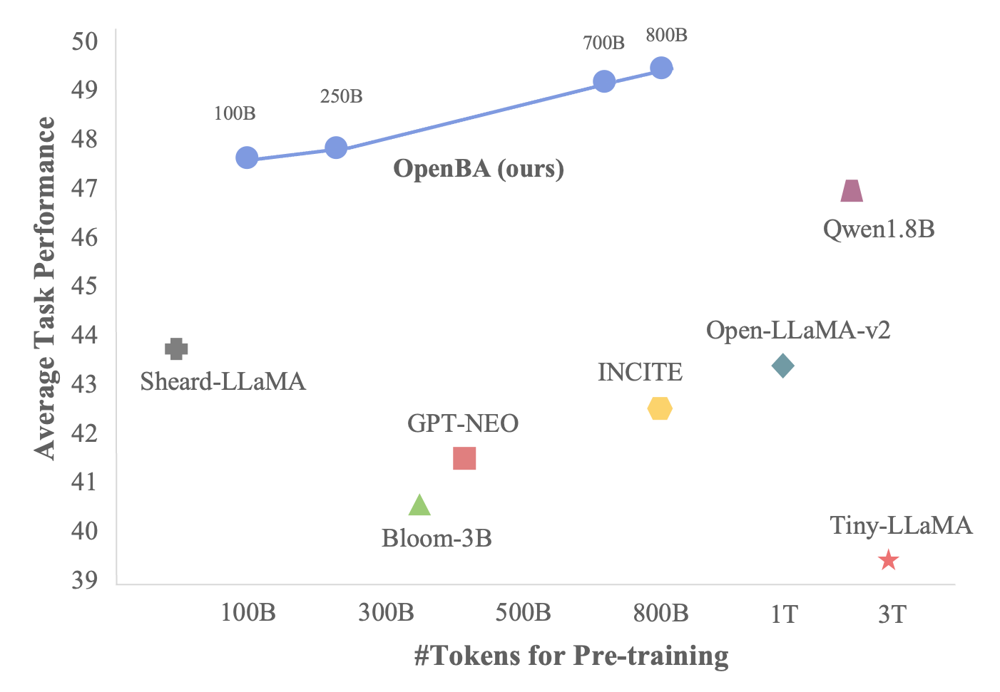
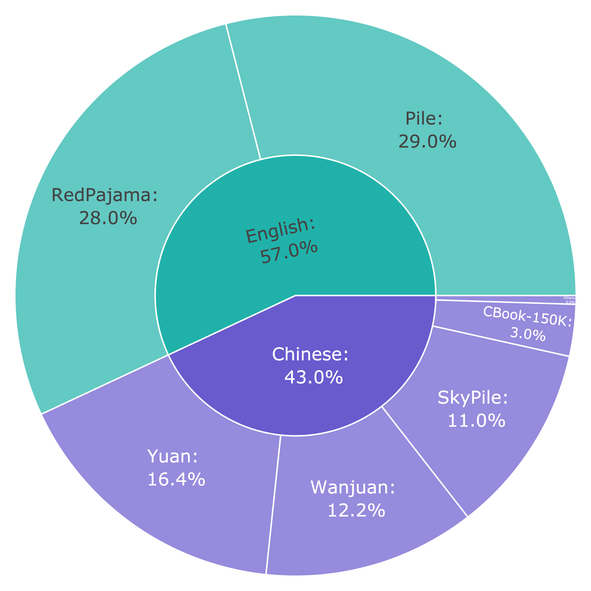
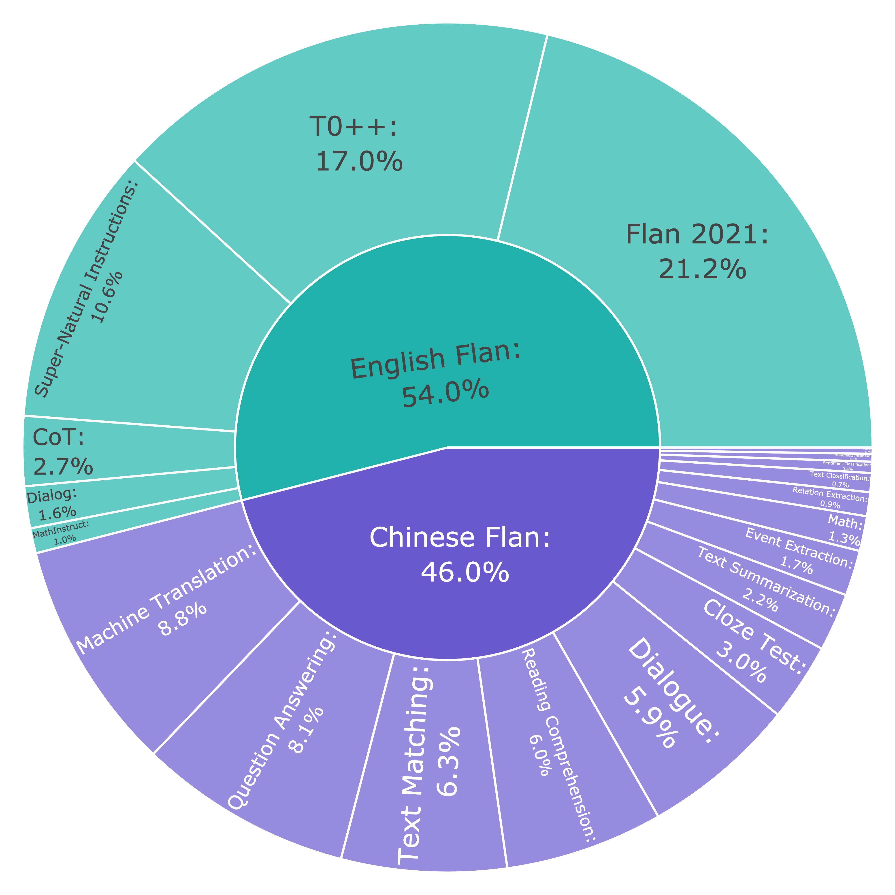

# OpenBA-V2: Reaching 77.3% High Compression Ratio with Fast Multi-Stage Pruning

<p align="center">
 <a href=""></a>
  <a href=""></a>
   <a href=""></a>
       <a href=""></a>
    <a href="https://arxiv.org/abs/2402.16602"></a>
    <a href="https://opennlg.cn/"></a>
</p>
这是OpenBA-V2的官方代码。OpenBA-V2是OpenBA的二代模型，通过多阶段模型裁剪获得。模型仅有3.4B参数量，相较于第一代模型裁剪了77.3%的模型参数，但拥有接近的模型性能。
整个裁剪过程涉及到layer裁剪，neural裁剪，以及词表-embedding裁剪等多个技术，在我们的技术报告中有详细说明。
<center>
<div align=center></div>
</center>
## 目录

- [开源计划](#开源计划)
- [训练过程](#训练过程)
- [评测结果](#评测结果)
- [用法](#用法)
- [训练](#训练)
  - [训练数据](#训练数据)
  - [模型裁剪](#模型裁剪)
  - [词表裁剪](#词表裁剪)
- [免责声明](#免责声明)

## 开源计划

我们将开源多个版本的模型，目前正在整理中，将于近期上传。

## 评测结果

- 我们的模型大小为3B左右，并且在开源的Pile数据上进行训练。因此我们主要选取了3B左右并且在开源数据上训练的模型进行比较。
- Qwen, Phi, MiniCPM 等在闭源数据上进行训练，我们的模型与这些模型还存在一定差距。

### Few-Shot，Zero-Shot测评结果

#### 知识，数学能力测评

| Model          | #Param. | Avg. | MMLU(5) | BBH(5) | GSM8K(8) | MATH(5) |
| :------------- | :-----: | :--: | :-----: | :----: | :------: | :-----: |
| LLaMA2         |   7B   | 23.2 |  44.3  |  33.2  |   13.6   |   1.8   |
| Tiny-Ilama     |  1.1B  | 14.0 |  25.4  |  26.8  |   2.0   |   1.6   |
| Open-Ilama-v2  |   3B   | 15.4 |  26.2  |  29.5  |   2.7   |   3.0   |
| Bloom-3B       |   3B   | 12.4 |  25.8  |  20.5  |   1.6   |   1.7   |
| MindLLM        |  1.3B  | 9.8 |  25.4  |  9.9  |   2.3   |   1.4   |
| GPT-NEO        |  2.7B  | 14.0 |  25.0  |  26.7  |   2.2   |   1.9   |
| INCITE-Base-3B |   3B   | 14.5 |  27.0  |  27.0  |   2.1   |   1.7   |
| Sheard-LLama   |  2.7B  | 15.4 |  27.1  |  29.2  |   2.4   |   2.8   |
| Qwen           |  1.8B  | 25.5 |  45.3  |  22.3  |   32.3   |   2.3   |
| OpenBA         |   15B   | 26.6 |  40.2  |  34.1  |   17.2   |  14.9  |
| OpenBA-v2      |  3.8B  | 23.9 |  37.9  |  29.5  |   13.5   |  14.8  |
| v2-Emb-Pruned  |  3.4B  | 24.0 |  37.9  |  29.6  |   13.6   |  14.8  |

#### 中文能力测评

| Model          | #Param. | Avg. | C-EVAL(5) | CMMLU(5) |
| :------------- | :-----: | :--: | :-------: | :------: |
| Chinese-LLaMA2 |   7B   | 34.5 |   35.9   |   33.0   |
| Bloom-3B       |   3B   | 25.3 |   25.4   |   25.2   |
| MindLLM        |  1.3B  | 26.9 |   28.0   |   25.7   |
| Qwen           |  1.8B  | 54.1 |   56.1   |   52.1   |
| Mini-cpm       |  2.7 B  | 51.1 |   51.1   |   51.1   |
| Phi2           |  2.7B  | 33.8 |   35.1   |   32.5   |
| OpenBA         |   15B   | 40.7 |   39.8   |   41.5   |
| OpenBA-v2      |  3.8B  | 38.3 |   37.8   |   38.8   |
| v2-Emb-Pruned  |  3.4B  | 38.1 |   37.3   |   38.9   |

#### QA测评

| Model          | #Param. | AVG. | SciQ | PIQA | ARC-E | ARC-C | LogiQA | BoolQ |
| :------------- | :-----: | :--: | :--: | :--: | :---: | :---: | :----: | :---: |
| LLaMA2         |   7B   | 69.0 | 93.7 | 78.1 | 76.4 | 53.0 |  30.7  | 82.1 |
| Baichuan2      |   7B   | 67.4 | 94.7 | 78.4 | 78.9 | 49.7 |  29.3  | 73.2 |
| ChatGLM3       |   7B   | 66.3 | 94.4 | 73.5 | 68.6 | 52.3 |  30.3  | 78.7 |
| Tiny-LLaMA     |   3B   | 56.1 | 94.0 | 73.3 | 55.3 | 30.1 |  26.3  | 57.8 |
| Open-LLaMA-v2  |   3B   | 61.9 | 91.8 | 76.2 | 66.5 | 39.0 |  28.1  | 69.6 |
| Bloom-3B       |   3B   | 59.2 | 93.5 | 70.7 | 64.2 | 35.2 |  29.3  | 62.1 |
| MindLLM        |  1.3B  | 49.5 | 80.2 | 64.9 | 47.1 | 24.8 |  28.0  | 52.1 |
| GPT-NEO        |  2.7B  | 59.7 | 93.3 | 74.2 | 65.3 | 35.2 |  28.4  | 61.8 |
| INCITE-Base-3B |   3B   | 61.1 | 90.7 | 74.6 | 67.7 | 40.2 |  27.7  | 65.9 |
| Sheard-LLama   |  2.7B  | 62.9 | 90.8 | 75.8 | 67.0 | 41.2 |  28.9  | 73.7 |
| Qwen           |  1.8B  | 61.1 | 92.2 | 73.6 | 63.7 | 38.5 |  31.6  | 66.8 |
| OpenBA         |   15B   | 67.8 | 94.6 | 71.9 | 69.7 | 54.4 |  33.3  | 82.6 |
| OpenBA-v2      |  3.8B  | 65.1 | 94.7 | 71.3 | 63.7 | 47.7 |  32.1  | 81.3 |
| v2-Emb-Pruned  |  3.4B  | 65.1 | 94.6 | 70.8 | 63.6 | 47.7 |  32.3  | 81.4 |

### 下游任务微调的测试结果

我们进一步探索了OpenBA模型在命名实体识别（NER）应用方面的潜力。
为了训练目的，我们利用了 [Pile-NER](https://arxiv.org/abs/2311.09122) 数据集，该数据集包含大约240,000个实体，涵盖了13,000个不同类别的实体。
随后，我们使用 MIT 和 CrossNER 数据集评估了我们模型OpenBA-v2-NER的性能，其中实体标签在训练阶段基本上是未见过的。
监督微调的prompt以及训练方法参考 [GNER](https://arxiv.org/abs/2402.16602)。
结果显示我们的模型明显优于其他模型，实现了超越原始15B模型修剪之前的卓越性能。

| Model            | Movie | Restaurant |  AI  | Literature | Music | Politics | Science | Avg |
| :--------------- | :---: | :--------: | :--: | :--------: | :---: | :------: | :-----: | :--: |
| Sheard-LLaMA     | 29.4 |    15.7    | 34.5 |    33.7    | 39.7 |   33.3   |  35.8  | 31.7 |
| Open-LLaMA-v2    | 63.0 |    44.3    | 58.9 |    50.2    | 72.0 |   66.4   |  62.5  | 59.6 |
| OpenBA-NER-15B   | 51.4 |    37.4    | 58.5 |    54.6    | 69.1 |   68.4   |  68.2  | 58.2 |
| OpenBA-v2-NER-3B | 60.3 |    43.3    | 63.8 |    54.3    | 72.4 |   67.4   |  70.6  | 61.7 |

## 用法

### 演示

首先，你需要安装以下的依赖：

```bash
pip install transformers==4.31.0 torch>=2.0 sentencepiece
```

``注意：`` 请确保您的transformers库版本不超过4.33.2 ！

UL2使用了特殊token `<S>` 和特殊token `<extra_id_0>` ，所以你可以将输入指令格式化为 `<S> {your input} <extra_id_0>` 以获得更好的答案。

### 训练脚本

我们的训练代码在 `training`文件夹中。基于[Megatron-LM](https://github.com/NVIDIA/Megatron-LM/)，我们进行了以下实现：

对于预训练，应事先安装相关依赖，如[Megatron-LM](https://github.com/NVIDIA/Megatron-LM/)中所述，然后您可以简单地运行以下命令将文本处理为字节，这样MMap数据集可以更快地读取：

```bash
cd training
bash scripts/data_process_span_corr.sh  # 处理预训练数据
bash scripts/data_process_flan.sh  # 处理微调数据
```

您可以通过以下命令在多个节点上运行分布式训练

```bash
bash scripts/train_d_ul2.sh  # 使用 d_ul2 方法进行均衡denoise训练
bash scripts/train_o_ul2.sh  # 使用 o_ul2 训练 
bash scripts/prune_model.sh   # 将模型检查点裁剪至任意指定配置 
```

其他的一些工具脚本

```bash
bash scripts/split_model.sh  # 转换模型的张量并行大小
bash convert_megatron_to_hf_ckpt.sh # megatron模型转化为hf模型
```

## 模型训练过程

### 训练数据


#### 预训练数据

我们的英文预训练数据主要由Pile和RedPajama整理收集而来，中文预训练数据从浪潮、万卷、SkyPile、CBook和各类百科（Wiki、百度百科）收集而来。最终预训练数据共有4.4TB，分布如下

<center>
<div align=center></div>
</center>


#### Flan数据

我们英文Flan数据主要由开源的Flan Collection和MathInstruct构成，中文数据为我们自己收集，涵盖18类自然语言处理任务。最终使用18,850,185条样本，分布如下

<center>
<div align=center></div>
</center>

### 训练细节
我们通过多阶段的模型裁剪将模型逐渐从15B裁剪至3.4B，模型每个阶段的参数以及使用的目标函数如下：

| Models    | #Params | Enc | Dec | Hidden |  FFN  | Heads | Data | Objective | Flops$\left(\times 10^{20}\right)$ |
| :-------- | :-----: | :-: | :-: | :----: | :----: | :---: | :---: | :-------: | :----------------------------------: |
| OpenBA    |   15B   | 12 | 36 | 4,096 | 11,008 |  40  | 350 B |    UL2    |                277.1                |
| Stage1    |  12.3B  | 10 | 30 | 4,096 | 11,008 |  40  |  10B  |   D-UL2   |                 6.7                 |
| Stage2    |  11.0B  |  8  | 27 | 4,096 | 11,008 |  40  |  10B  |   D-UL2   |                 5.9                 |
| Stage3    |  9.9B  |  8  | 24 | 4,096 | 11,008 |  40  |  15B  |   D-UL2   |                 8.1                 |
| Stage4    |  3.8B  |  8  | 24 | 2,560 | 6,912 |  20  |  65B  |   D-UL2   |                 13.0                 |
| Stage5    |  3.8B  |  8  | 24 | 2,560 | 6,912 |  20  | 700B |   O-UL2   |                 99.1                 |
| Prune Emb |  3.4B  |  8  | 24 | 2,560 | 6,912 |  20  |   -   |     -     |                  -                  |

- OpenBA家族使用的是 [UL2](https://arxiv.org/pdf/2205.05131.pdf) 作为预训练目标函数。在压缩的过程中，我们针对不同的阶段对 UL2 进行了优化，分别有 D-UL2 以及 O-UL2 等变种，分别用于解决裁剪后多种noise不均衡，以及优化UL2训练过程种产生的padding问题。
- 模型的深度裁剪参考了过去的工作，选择裁剪中间的，相隔较远的非连续层。模型宽度的裁剪参考了 [Sheard-LLaMA](https://github.com/princeton-nlp/LLM-Shearing) 以及 [LLM-Pruner](https://github.com/horseee/LLM-Pruner)，按照模型前向计算的结构依赖关系，以及目标模型配置，随机裁剪矩阵权重的行和列。
- 以上方法我们在开源的LLaMA2-13B和LLaMA2-7B中继续进行了实验，分别裁剪了模型50%的参数，并在20B的开源数据 [The Pile](https://github.com/EleutherAI/the-pile) 上进行了恢复训练，细节可参考我们的开源仓库：[Pruning-LLM](https://github.com/jordddan/Pruning-LLMs)

### 模型裁剪
#### 深度裁剪

### 词表裁剪

模型词表裁剪也是本项目的一个亮点，仅裁剪不常用的词表，可以裁剪近10%的参数而完全不损害模型性能。我们做了分析实验，一般来说，中文词需求的词表较少，而英文需要的模型词表较多，实验结果如下

<center>
<div align=center></div>
</center>

词表裁剪代码以及使用说明请参考 [这里](./training/prune_vocab_emb/README.md).

## 免责声明

使用OpenBA-LM应遵循社会规范，不得用于危害国家或社会安全或违反法律的活动。此外，我们还要求用户不要将OpenBA-LM用于尚未经过适当安全审查和记录的互联网服务。我们希望所有用户都遵守这一原则，确保技术发展在一个有序、合法的环境中进行。

我们已尽最大努力确保模型训练过程中使用的数据符合规定。然而，尽管我们付出了巨大的努力，但由于模型和数据的复杂性，仍可能出现意外问题。如果在提供服务过程中，通过使用本项目中包含的模型或其修改版本生成误导性或有害的陈述，责任在于服务提供商，与本项目无关。

## 引用

如果您觉得我们的代码和数据对您有帮助，请按照以下格式引用：

```
@article{li2023openba,
  title={OpenBA: An Open-sourced 15B Bilingual Asymmetric seq2seq Model Pre-trained from Scratch},
  author={Li, Juntao and Tang, Zecheng and Ding, Yuyang and Wang, Pinzheng and Guo, Pei and You, Wangjie and Qiao, Dan and Chen, Wenliang and Fu, Guohong and Zhu, Qiaoming and others},
  journal={arXiv preprint arXiv:2309.10706},
  year={2023}
}
```
