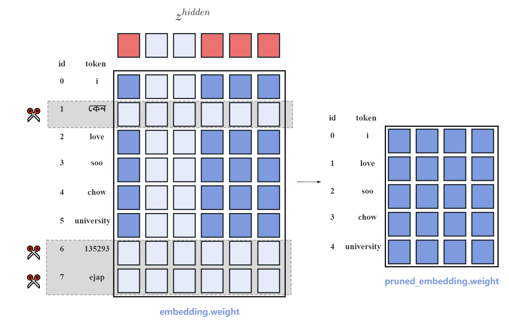

# Vocab and Embedding Pruning
# 词表裁剪
大模型的词表通常很大，并且由于hidden_size也较大，通常为2048或4096，整个embedding权重的大小为vocab_size * hidden_size。以多语言模型Multi-Lingual-T5为例，词表大小约260000。总参数量约为1.1B。但如果仅用于中英文任务，有大量词表不会被使用到，造成很大的空间浪费。我们提供了一套裁剪SentencePiece分词器的方法，并同时裁剪模型的embedding权重。通过词频排序的方法，选择在后续使用过程中模型几乎不会碰到的token并将其剔除，并裁剪对应的embedding权重。方法示意图如下：
<p align="center">

</p>


## 使用方法
该方法的核心思想是，将词表中不常用的token剔除。因此，首先要选定一个目标语料库，一般可以是预训练语料，在该语料库上统计词频，并按照词频排序，生成词表频率排序后的txt文件。具体的，每行应该为`token token_id token_frequency`以空格隔开。然后选定一个目标词表大小n，选择前n个token以及所有特殊token构建新的sentencepiece model。结合新旧的sentencepiece model裁剪embedding。
使用脚本如下
```
python get_vocab_freq.py # 统计词频
python create_new_spm.py # 创建新的sentence piece model
python prune_huggingface_embedding.py # 用于裁剪huggingface模型
python prune_megatron_embedding.py # 用于裁剪megatron的模型
```
注意，上述文件为参考代码。需要使用者自行修改参数适配自己的模型。对于LlaMA类模型，我们在另一个仓库中提供了参考：[Pruning-LLMs](https://github.com/jordddan/Pruning-LLMs)

## 说明
- 上述代码为使用SentencePiece的模型裁剪方法。对于使用tiktoken分词的模型，例如Qwen系列，我们也进行了开发，但是似乎由于tiktoken本身无法添加unknown token，导致裁剪后对于不常见的词汇，core_bpe分词器会报错，暂时无法正确使用。
- 原则上来说不建议随意更改原有的BPE分词模型，该方法只是一次简单尝试。更改分词器以及embedding后的模型在后续训练中会遇到哪些问题暂时还未完全探索。但我们对于15B的OpenBA模型将词表从26W裁剪到5W，同时进行深度裁剪后的恢复训练，训练了10B tokens，训练loss曲线正常。